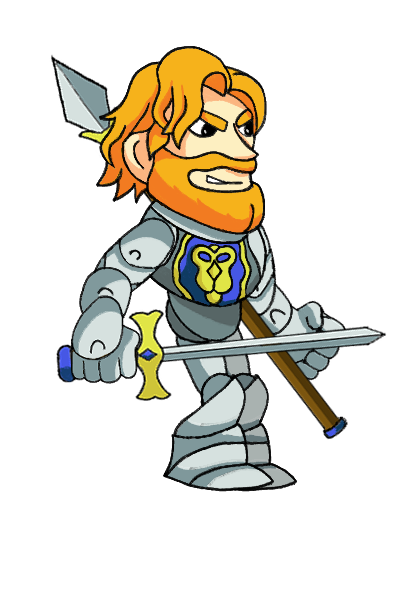

# DishonorFactions : Game Design Document
## ÍNDICE:
- Introducción.
- Características del videojuego.
    - Género.
    - Público objetivo.
    - Características principales.
    - Flujo del juego.
    - Controles.
    - Controladores soportados.
    - Interfaz.
    - Arte.
    - Personajes.
        - Elfos.
        - Orcos.
        - Humanos.
    - Escenarios.
    - Historia
    - Audio.
        - Música.
        - Efectos de sonido.
    - Funcionamiento de la red en el juego.
- Juegos similares.

Proyecto colaborativo de la asignatura de Juegos en Red
## INTRODUCCIÓN:

__Dishonor Factions__ es un juego en dos dimensiones para PC donde se podrá jugar de forma online competitiva contra otro jugador.
El concepto principal del juego es el siguiente: dos jugadores se enfrentarán en un campo de batalla. Cada jugador deberá elegir una facción, cada facción posee unas características distintas que se especificarán más adelante. Cuando el jugador ha elegido su facción,  el principal objetivo que tiene será destruir la base enemiga. Cada jugador controlará a un personaje principal (llamado campeón) el cual podrá mover a lo largo del escenario y dichos personajes tendrán una habilidad, tropas y características principales. Las tropas salen cada x segundos desde la base e irán hacia la base enemiga para atacar y disminuir su vida o si se encuentran a otro enemigo por el escenario dichas tropas la atacarán, en cuanto a la habilidad cada jugador podrá usarla cada x segundos. Por último, cabe destacar que si el personaje principal controlado por cada jugador muere en la partida volverá a aparecer a los 10 segundos ya que consideramos que hace más interesante el transcurso de la partida, haciendo que el personaje principal sea de vital importancia.

## CARACTERÍSTICAS DEL VIDEOJUEGO:
### GÉNERO:

El videojuego será del género __Tower Defense Competitivo__ . Se trata de un subgénero de estrategia en el cual el objetivo de los jugadores es defender un edificio obstruyendo o atacando a los atacantes.

### PÚBLICO OBJETIVO:

El juego irá destinado sobre todo a jóvenes de entre 10 y 25 años que jueguen en ordenador.

### CARACTERÍSTICAS PRINCIPALES:

1. **Planteamiento sencillo:** _“Dishonor Factions”_ no posee gran carga histórica, sino que se utiliza un simple argumento para el desarrollo del juego y que los jugadores tengan el objetivo del juego claro.

Este argumento se centra en el personaje de Issabell II, difunta reina del reino de los elfos. Tras su muerte, las facciones de los humanos, orcos y elfos entraron en batalla para poder gobernar el territorio con sus tropas y campeones. 

2. **Dinamismo:** _“Dishonor Factions”_ debe ser dinámico y crear una sensación de tensión y satisfacción al jugador.

3. **Juego táctico:** En _“Dishonor Factions”_, los jugadores no tendrán  tropas infinitas, sino que deberán organizarse de forma inteligente para poder aguantar los ataques del enemigo y controlar su personaje como crean conveniente para ganar.

### FLUJO DEL JUEGO:

En una partida ambas facciones comenzarán con la vida al máximo. Las tropas saldrán cada x tiempo de ambas bases dirección el bando contrario hasta que lleguen a la base enemiga o se encuentren con otras tropas enemigas y deban luchar. Mientras tanto, los jugadores controlarán a su campeón el cuál puede decidir entre atacar a las tropas enemigas, a la base enemiga o al campeón enemigo. Cuando un campeón muera, deberá esperar un tiempo de 10 segundos. Gana el primero que derribe la torre al contrario.

### CONTROLES:

El sistema de controles para el movimiento se basa en el sistema típico de todos los juegos: 
- __W A S D:__ Movimiento horizontal y vertical.
- __Click izquierdo:__ Ataque básico.
- __E:__ Habilidad especial del campeón.

### CONTROLADORES SOPORTADOS:

1. Teclado y ratón.

### INTERFAZ:

La interfaz que se realizará será sencilla y sin muchos elementos para no entorpecer la experiencia del usuario. Además, el estilo visual que se emplea para la interfaz será cartoon, en cuanto a la disposición de los elementos en las interfaces será la siguiente:
- Menú principal: En el menú principal estará el nombre del videojuego en la parte central arriba del todo, más abajo, también en la parte central vendrán tres botones uno debajo de otro, con forma de pergamino (acorde a la temática medieval) con las opciones de jugar, ajustes y salir del juego.
- Pantalla del juego: En cuanto a la pantalla del juego cada jugador verá la disponibilidad de su habilidad en la parte inferior donde esté colocada su base, dicha habilidad será visible en un círculo con una imagen dentro que vaya acorde a la habilidad, arriba a la derecha habrá un botón que permita al jugador cambiar los ajustes como el sonido, y también poder salir del juego, dicho botón tendrá también una forma circular.

### ARTE:
El arte del videojuego tendrá un estilo Cartoon.
A continuación se presentará un boceto de los campeones de las tres facciones:

 Princesa Noveny  / Sir Thomas  / General Kalapax
 

Se han tomado referencias del videojuego _"Brawlhalla"_ en la estética de los personajes además referencias culturales de los juegos de rol y películas de fantasía como _"War of Warcraft"_ o _"El Señor de los Anillos"_ al incorporar civilizaciones no humanas como en este caso los orcos y los elfos.

Ejemplos de referencias:

En cuanto a la elección de las distintas facciones es una clara referencia al videojuego _"For Honor"_:

_Fuente: "For Honor"_

### PERSONAJES:

En los personajes, el jugador podrá elegir entre tres facciones bien diferenciadas: Los __orcos__, los __elfos__ y los __humanos__.

Además, en cada facción, existen dos tipos de grupos de unidades: Los __campeones__ y las __tropas__.
A continuación, se detallarán las características principales de cada una de las unidades de todas las facciones:
1. __Orcos:__
    - Descripción: Las unidades orcos son las más fuertes por lo que su vida se verá aumentada respecto al resto de facciones. Pero son las que menos velocidad de movimiento y ataque tienen.
    - Campeones:
        - _Kalapax_:
            - Ataques:
                1. Ataque cuerpo a cuerpo en área.

            - Habilidades:
                1. Cuando acabas con una tropa recuperas x puntos de vida.

    - Tropas:
        - Guerrero orco.

3. __Elfos:__
    - Descripción: Las unidades élficas son las más rápidas y ágiles. Pero tanto su vida como su fuerza se ven reducidas.
    - Campeones:
        - _Noveny_:
            - Ataques:
                1. Ataque a distancia (arco).

            - Habilidades:
                1. Cuando mata a una tropa invoca a un guerrero elfo aliado.

    - Tropas:
        - Guerrero elfo.

5. __Humanos:__
    - Descripción: Las unidades humanas poseen una vida equilibrada y un ataque y velocidad equilibrada.
    - Campeones:
        - _Thomas_:
            - Ataques:
                1. Ataque cuerpo a cuerpo.
                2. Ataque a distancia.

            - Habilidades:
                1. Posibilidad de cambiar de ataque _"a distancia"_ a _"cuerpo a cuerpo"_ o viceversa.

    - Tropas:
        - Guerrero humano.

### ESCENARIOS:

El escenario será una zona rectangular con una estética correspondiente a la temática del juego, como por ejemplo un bosque. En la parte izquierda está la base de un jugador, y en la parte derecha la base del jugador contrario. Las bases del escenario no ocuparán mucha zona física. Por último, cabe destacar que los personajes principales se podrán mover por todo el mapa. A continuación, vamos a presentar unas imágenes en las que el escenario de nuestro videojuego se podría parecer a estos.

La cámara que se utilizará a lo largo de la partida será una cámara inclinada con un plano picado.

### HISTORIA:

El juego no posee una historia como tal, sino que simplemente son tres facciones que se enfrentarán entre ellos por recuperar el honor.

### AUDIO:

El juego tendrá distintos audios, en primer lugar habrá un audio para la interfaz del juego, antes de comenzarlo, otro mientras se está jugando y por último, un audio que se reproducirá en caso de que el jugador pierda la partida. Además, cabe añadir que ciertas acciones que se produzcan durante el juego tendrán su propio audio.
1. __Música__:
    - Ambientación del escenario.
    - Música de victoria.
    - Música de derrota.
    - Música de menú principal.
    - Música de fondo inGame

3. __Efectos de sonido__:
    - Sonidos de cada tropa.
    - Sonidos de cada campeón.
    - Sonidos de interfaz gráfica.

### FUNCIONAMIENTO DE LA RED EN EL JUEGO:

La comunicación en este juego debe ser fluida. Los jugadores pueden moverse y atacar, por lo que esta información debe traspasarse en todo momento dentro del juego. Además, en las partidas hay unos pequeños jugadores controlados por la IA que también poseen la característica de atacar. 

Los jugadores tienen habilidades especiales que el enemigo debe poder observar en el momento de su ejecución.

Por último, el objetivo principal del jugador es derruir la fortificación enemiga, por lo que habrá que informar de la vida que posee la misma en todo momento.

### JUEGOS SIMILARES:

A continuación, se añadirán una serie de videojuegos similares a Dishonored factions:

_Fuente: "Stickman War Legacy"_

_Fuente: "Plantas Vs Zombies"_

_Fuente: "Empire Defense"_
