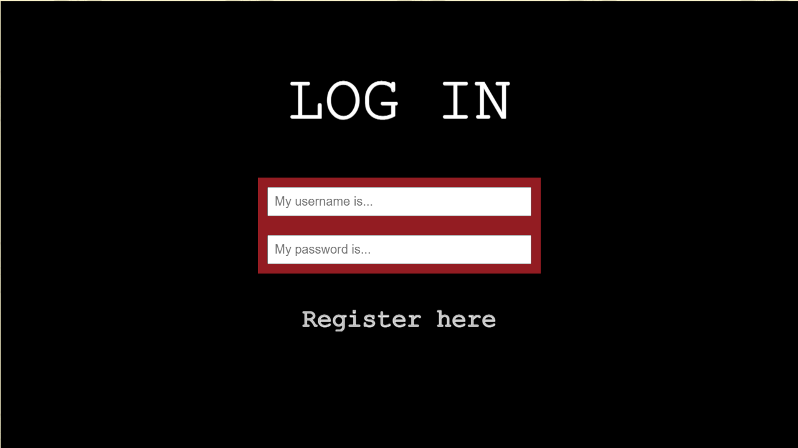
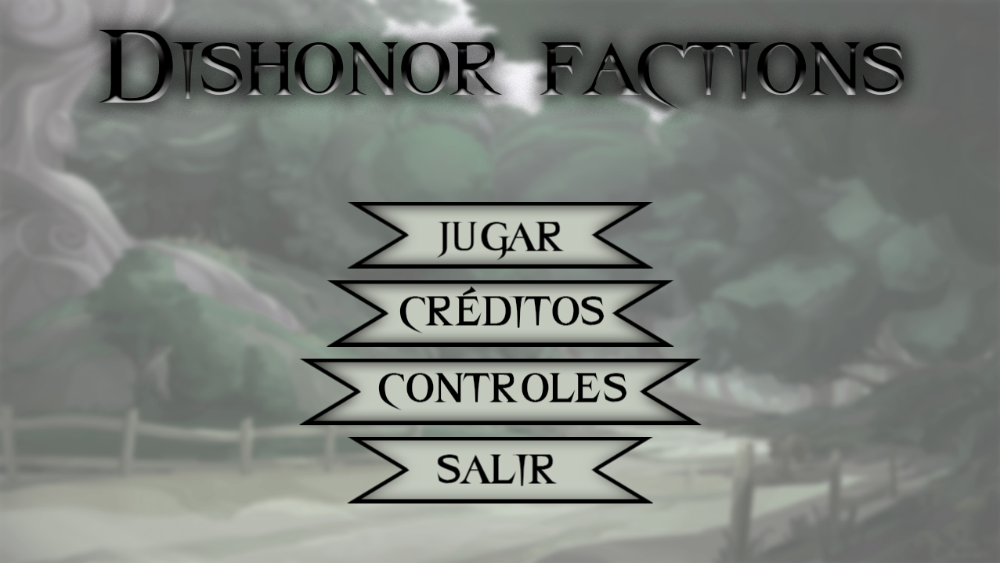
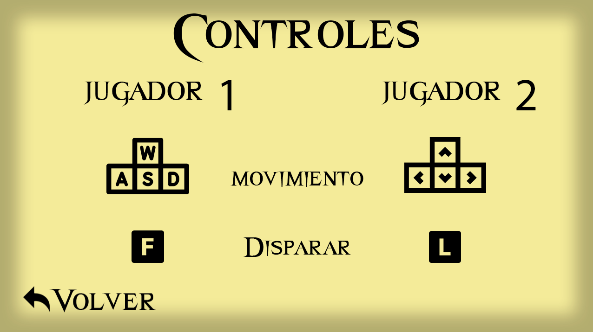
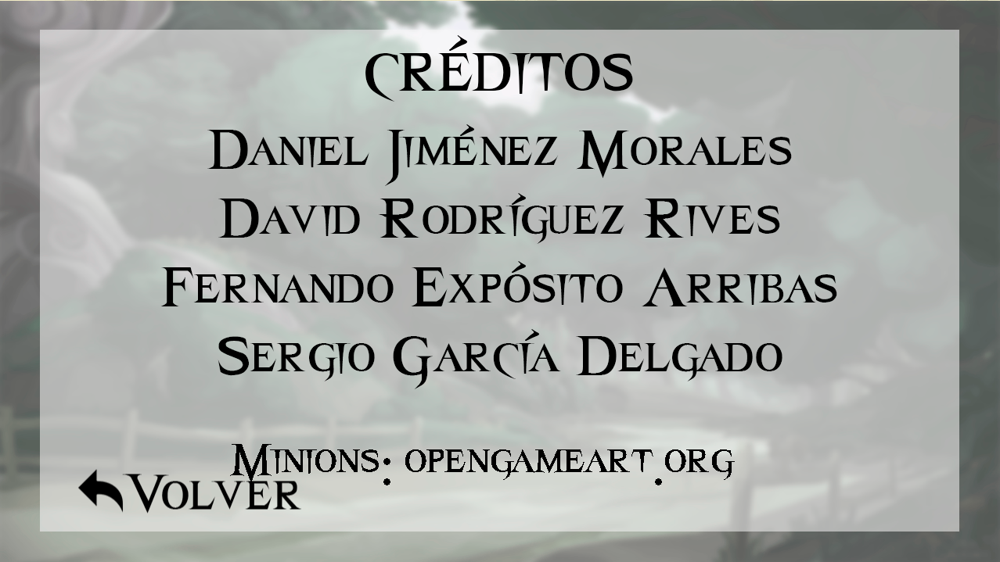
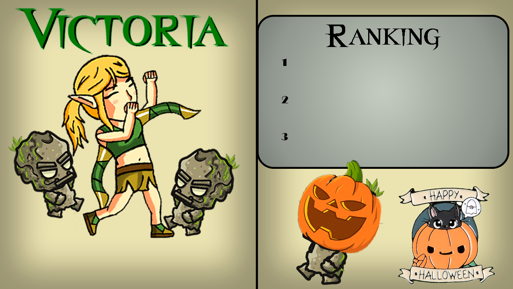

# DishonorFactions : Game Design Document
## ÍNDICE:
- Introducción.
- Características del videojuego.
    - Género.
    - Público objetivo.
    - Características principales.
    - Flujo del juego.
    - Controles.
    - Controladores soportados.
    - Interfaz.
    - Arte.
    - Personajes.
        - Elfos.
        - Orcos.
        - Humanos.
    - Escenarios.
    - Historia
    - Audio.
        - Música.
        - Efectos de sonido.
    - Funcionamiento de la red en el juego.
        - Funcionamiento del servidor
        - Clases y métodos implementados
- Juegos similares.

Proyecto colaborativo de la asignatura de Juegos en Red
## INTRODUCCIÓN:

__Dishonor Factions__ es un juego en dos dimensiones para PC donde se podrá jugar de forma online competitiva contra otro jugador.
El concepto principal del juego es el siguiente: dos jugadores se enfrentarán en un campo de batalla. Cada jugador deberá elegir una facción, cada facción posee unas características distintas que se especificarán más adelante. Cuando el jugador ha elegido su facción,  el principal objetivo que tiene será el de destruir la base enemiga. Cada jugador controlará a un personaje principal (llamado campeón) el cual podrá mover a lo largo del escenario y dichos personajes tendrán una habilidad, tropas y características principales. Las tropas salen cada segundo desde la base e irán hacia la base enemiga para atacar y disminuir su vida o si se encuentran a otro enemigo por el escenario dichas tropas la atacarán, en cuanto a la habilidad especial de cada personaje, cada jugador podrá usarla cada x segundos. Por último, cabe destacar que si el personaje principal controlado por cada jugador muere en la partida volverá a aparecer a los 10 segundos ya que consideramos que hace más interesante el transcurso de la partida, haciendo que el personaje principal sea de vital importancia. Los personajes controlados por el usuario podrán atacar a la base enemiga pero estos ataques harán menos daño que el de los minions, haciendo de vital importancia la defensa y eliminación de estos.

## CARACTERÍSTICAS DEL VIDEOJUEGO:
### GÉNERO:

El videojuego será del género __Tower Defense Competitivo__ . Se trata de un subgénero de estrategia en el cual el objetivo de los jugadores es defender un edificio obstruyendo o eliminando a los atacantes.

### PÚBLICO OBJETIVO:

El juego irá destinado sobre todo a jóvenes de entre 10 y 25 años que jueguen en ordenador. Este público objetivo se ha decidido siguiendo el razonamientode que a los jugadores entre estas edades les parecería más atractivo las mecánicas y estética de nuestro videojuego.

### CARACTERÍSTICAS PRINCIPALES:

1. **Planteamiento sencillo:** _“Dishonor Factions”_ no posee gran carga histórica, sino que se utiliza un simple argumento para el desarrollo del juego y que los jugadores tengan el objetivo del juego claro.

2. **Dinamismo:** _“Dishonor Factions”_ debe ser dinámico y crear una sensación de tensión y satisfacción al jugador.

3. **Juego táctico:** En _“Dishonor Factions”_, los jugadores no tendrán  tropas infinitas, sino que deberán organizarse de forma inteligente para poder aguantar los ataques del enemigo y controlar su personaje como crean conveniente para ganar.

### FLUJO DEL JUEGO:

En una partida ambas facciones comenzarán con la vida al máximo. Las tropas saldrán cada segundo de una posición aleatoria de ambas bases dirección el bando contrario hasta que lleguen a la base enemiga o se encuentren con otras tropas enemigas y deban luchar. Mientras tanto, los jugadores controlarán a su campeón el cuál puede decidir entre atacar a las tropas enemigas, a la base enemiga o al campeón enemigo. Cuando un campeón muera, deberá esperar un tiempo de 10 segundos. El primero que derribe la torre al contrario ganará la batalla.

### CONTROLES:

El sistema de controles para el movimiento se basa en el sistema típico en los juegos pc: 
-Primer jugador
    - __W A S D:__ Movimiento horizontal y vertical.
    - __F:__ Ataque básico.
-Segundo jugador
    - __Flechas de dirección:__ Movimiento horizontal y vertical.
    - __L:__ Ataque básico.

### CONTROLADORES SOPORTADOS:

1. Teclado.

### INTERFAZ:

La interfaz que se realizará será sencilla y sin muchos elementos para no entorpecer la experiencia del usuario. Además, el estilo visual que se emplea para la interfaz será cartoon, en cuanto a la disposición de los elementos en las interfaces será la siguiente:
- Pantalla de carga: En esta pantalla, se cargarán todos los recursos necesarios para el correcto funcioamiento del videojuego. Para informar al jugador de cómo va progresando este proceso, se mostrará por pantalla una pequeña barra de progreso.

- Pantalla de inicio de sesión: En esta pantalla el jugador podrá iniciar sesión con su usuario y contraseña, esto permitirá que el jugador pueda jugar de forma online con otros usuarios.

- Menú principal: En el menú principal estará el nombre del videojuego en la parte central arriba del todo, más abajo, también en la parte central vendrán tres botones uno debajo de otro, con forma de pergamino (acorde a la temática medieval) con las opciones de jugar, ajustes y salir del juego.

- Pantalla de controles: Esta pantalla mostrará al jugador los controles para poder mover su campeon y para poder atacar.

- Pantalla de créditos: Una simple pantalla de créditos con los nombres del equipo de desarrollo de Dishonor Factions y la fuente de la cual hemos importado los minions.

- Pantalla de salir: En el caso de esta pantalla, hemos decidido incluir una pantalla oscura la cual simulará el cierre del juego.

- Pantalla del juego: En cuanto a la pantalla del juego cada jugador verá la disponibilidad de su habilidad en la parte inferior donde esté colocada su base, dicha habilidad será visible en un círculo con una imagen dentro que vaya acorde a la habilidad, arriba a la derecha habrá un botón que permita al jugador cambiar los ajustes como el sonido, y también poder salir del juego, dicho botón tendrá también una forma circular.

- Pantalla de pausa: Esta pantalla permitirá a los jugadores pausar la partida mientras están jugando en caso de que lo deseen. Esta pantalla será expuesta cuando un jugador pulse la tecla E.

- Pantallas de victoria: Estas pantallas serán únicas para cada personaje victorioso e incluirán un pequeño ranking cuando varios jugadores jueguen a la vez.

### ARTE:
El arte del videojuego tendrá un estilo Cartoon.
A continuación se presentará un boceto de los campeones de las tres facciones:

_Princesa Noveny  . / . Sir Thomas . / . General Kalapax_
 

Se han tomado referencias del videojuego _"Brawlhalla"_ en la estética de los personajes además referencias culturales de los juegos de rol y películas de fantasía como _"War of Warcraft"_ o _"El Señor de los Anillos"_ al incorporar civilizaciones no humanas como en este caso los orcos y los elfos.

Ejemplos de referencias:

En cuanto a la elección de las distintas facciones es una clara referencia al videojuego _"For Honor"_:

_Fuente: "For Honor"_

### PERSONAJES:

En los personajes, el jugador podrá elegir entre tres facciones bien diferenciadas: Los __orcos__, los __elfos__ y los __humanos__.

Además, en cada facción, existen dos tipos de grupos de unidades: Los __campeones__ y las __tropas__.
A continuación, se detallarán las características principales de cada una de las unidades de todas las facciones:
1. __Orcos:__
    - Descripción: Las unidades orcos son las más fuertes por lo que su vida se verá aumentada respecto al resto de facciones. Pero son las que menos velocidad de movimiento y ataque tienen.
    - Campeones:
        - _Kalapax_:
            - Ataques:
                1. Ataque a distancia lanzando el hacha.

    - Tropas:
        - Minion orco.

3. __Elfos:__
    - Descripción: Las unidades élficas son las más rápidas y ágiles. Pero tanto su vida como su fuerza se ven reducidas.
    - Campeones:
        - _Noveny_:
            - Ataques:
                1. Ataque a distancia usando su poderoso arco.

    - Tropas:
        - Minion elfo.

5. __Humanos:__
    - Descripción: Las unidades humanas poseen una vida equilibrada y un ataque y velocidad equilibrada.
    - Campeones:
        - _Thomas_:
            - Ataques:
                1. Ataque a distancia lanzando una lanza.

    - Tropas:
        - Minion humano.

### ESCENARIOS:

El escenario será una zona rectangular con una estética correspondiente a la temática del juego, como por ejemplo un bosque o un páramo. En la parte izquierda está la base de un jugador, y en la parte derecha la base del jugador contrario. Por último, cabe destacar que los personajes principales se podrán mover por todo el mapa. A continuación, vamos a presentar unas imágenes del escenario de nuestro videojuego.

La cámara que se utilizará a lo largo de la partida será una cámara inclinada con un plano picado.

### HISTORIA:

Este argumento se centra en el personaje de Issabell II, difunta reina del reino de los elfos. Tras su muerte, las facciones de los humanos, orcos y elfos entraron en batalla para poder gobernar el territorio con sus tropas y campeones. 

### AUDIO:

El juego tendrá distintos audios, en primer lugar habrá un audio para la interfaz del juego, antes de comenzarlo, otro mientras se está jugando y por último, un audio que se reproducirá en caso de que el jugador pierda la partida. Además, cabe añadir que ciertas acciones que se produzcan durante el juego tendrán su propio audio.
1. __Música__:
    - Música de menú principal
    <audio class="Audio-1" src="./dishonorfactions/src/main/resources/static/Sounds/MainMenu.wav" controls=""></audio>
    - Música de fondo inGame

3. __Efectos de sonido__:
    - Sonidos de cada tropa.
    - Sonidos de cada campeón.
    - Sonidos de interfaz gráfica.

### FUNCIONAMIENTO DE LA RED EN EL JUEGO:
1.  __Funcionamiento del servidor del juego__

      Se ha hecho uso de el programa eclipse, con la extensión de java enterprise utilizando un lenguaje basado en java con herramientas Maven y Spring.
        
      La comunicación de este juego se lleva a cabo a través de mensajes JSON con los datos necesarios. Los jugadores podrán moverse y atacar siendo esta información traspasada entre ambos. Esta información se deberá enviar a los usuarios según las acciones que estos realicen: moverse, atacar.
        
      Nuestro videojuego cuenta con un sistema de Nicks los cuales serán unicos a cada jugador y permitirá que los jugadores puedan identificarse.

En primer lugar, los jugadores deberán logearse y podrán buscar una partida en linea 

** Funcionamiento del servidor del juego**

### JUEGOS SIMILARES:

A continuación, se añadirán una serie de videojuegos similares a Dishonored factions:

_Fuente: "Stickman War Legacy"_

_Fuente: "Plantas Vs Zombies"_

_Fuente: "Empire Defense"_
